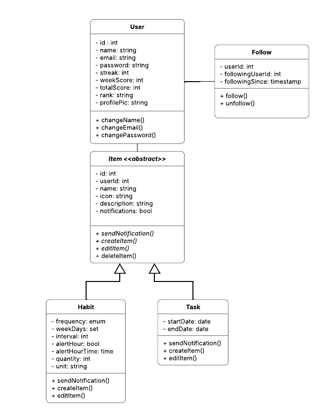
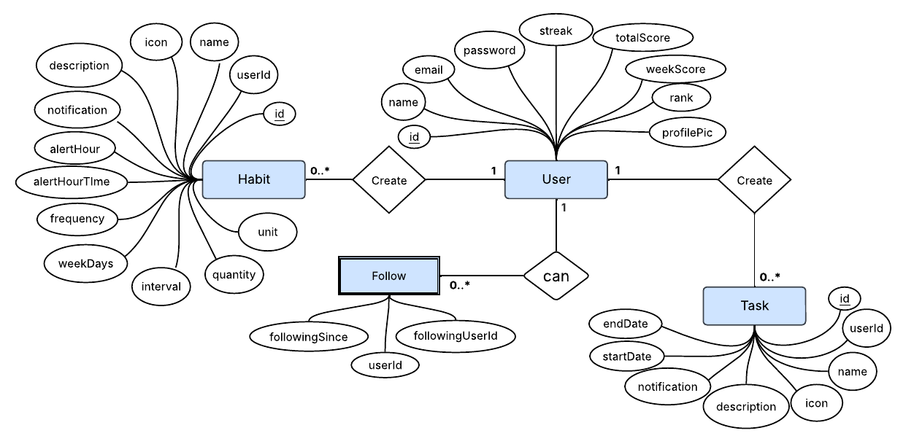
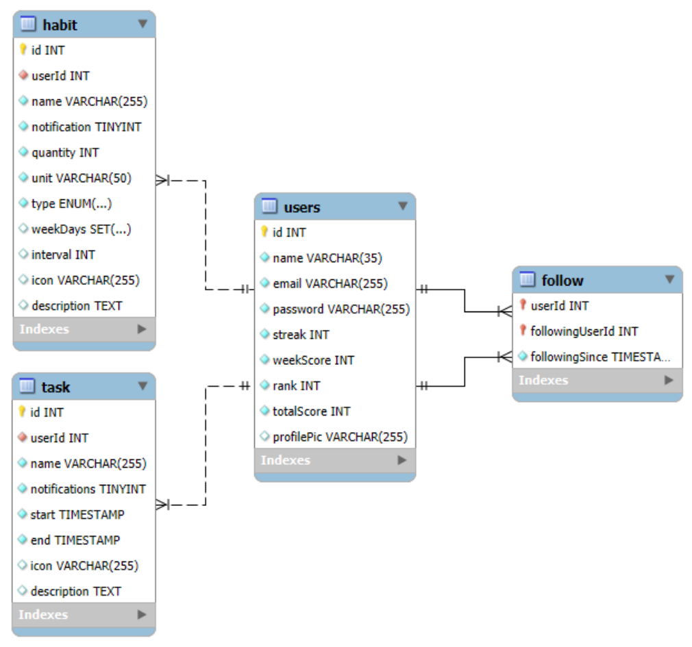

# Arquitetura da Solução

Pré-requisitos: <a href="3-Projeto de Interface.md"> Projeto de Interface</a>

Definição de como o software é estruturado em termos dos componentes que fazem parte da solução e do ambiente de hospedagem da aplicação.

## Diagrama de Classes

O diagrama de classes ilustra graficamente como será a estrutura do software, e como cada uma das classes da sua estrutura estarão interligadas. Essas classes servem de modelo para materializar os objetos que executarão na memória.

## Modelo ER

O Modelo ER representa através de um diagrama como as entidades (coisas, objetos) se relacionam entre si na aplicação interativa.

## Esquema Relacional

O Esquema Relacional corresponde à representação dos dados em tabelas juntamente com as restrições de integridade e chave primária.
 

## Modelo Físico

Entregar um arquivo banco.sql contendo os scripts de criação das tabelas do banco de dados. Este arquivo deverá ser incluído dentro da pasta src\bd.

## Tecnologias Utilizadas

#### Front-end (Mobile)
- **Linguagem:** JavaScript / TypeScript  
- **Framework:** React Native, Expo  

#### Back-end
- **Linguagem:** C#  
- **Framework:** ASP.NET Core Web API  
- **Padrões e práticas:** RESTful API, Entity Framework Core (ORM), Princípios SOLID

#### Banco de Dados
- **SGBD:** MySQL  
- **Ferramenta:** MySQL Workbench

#### Serviços Web / Integrações
- API REST entre front-end e back-end
- Hospedagem futura: Azure

#### Ambientes e Ferramentas de Desenvolvimento
- **IDE Front-end:** Visual Studio Code  
- **IDE Back-end:** Visual Studio 2022
- **Gerenciador de pacotes:** npm (front-end), NuGet (back-end)  
- **Controle de versão:** Git + GitHub

## Hospedagem

Explique como a hospedagem e o lançamento da plataforma foi feita.

## Qualidade de Software

Para garantir que a qualidade do aplicativo Habitum atenda às expectativas dos usuários e mantenha um alto padrão, utilizaremos o processo de avaliação definido pelas normas ISO/IEC 25010 e ISO/IEC 14598. Essas normas fornecem uma estrutura para identificar, medir e analisar as características de qualidade de software, permitindo uma avaliação confiável do produto ao longo de seu ciclo de vida.

### ISO/IEC 14598 - Etapas da Avaliação

#### Propósito da Avaliação
Avaliar a qualidade do software para garantir que ele seja eficaz, eficiente, confiável e agradável para o usuário final (usuários mobile interessados em criar hábitos e realizar tarefas).

#### Tipo de Software
Aplicativo mobile (React Native), com backend em ASP.NET e banco de dados em MySQL, voltado para produtividade pessoal.

#### Modelo de Qualidade Utilizado
Foi adotado a ISO/IEC 25010 como referência de características de qualidade.

### ISO/IEC 25010

Com base no Tipo de Software, foram escolhidas 6 características:

### Características e Subcaracterísticas Selecionadas

| Característica             | Subcaracterística         | Justificativa                                                                 |
|----------------------------|----------------------------|-------------------------------------------------------------------------------|
| **Adequação Funcional**    | Correção funcional         | O app deve fornecer resultados corretos e consistentes em suas funcionalidades. |
|                            | Pertinência funcional      | As funções devem ser relevantes e alinhadas às necessidades dos usuários.     |
| **Eficiência de Desempenho** | Tempo de resposta         | A interação com o app deve ser rápida, especialmente em tarefas cotidianas.    |
|                            | Uso de recursos            | O app deve ser eficiente no uso de memória, CPU e bateria, especialmente em dispositivos móveis. |
| **Confiabilidade**         | Tolerância a falhas        | O sistema deve continuar funcionando mesmo diante de erros pontuais.           |
|                            | Disponibilidade            | O app precisa estar acessível sempre que o usuário desejar utilizá-lo.         |
| **Usabilidade**            | Facilidade de uso          | A interface deve ser intuitiva, promovendo uma experiência fluida.             |
|                            | Estética                   | A aparência visual deve ser agradável e coerente com o propósito do app.       |
| **Segurança**              | Confidencialidade          | Os dados pessoais dos usuários devem ser protegidos contra acessos indevidos.  |
|                            | Integridade                | As informações devem permanecer corretas e não sofrer alterações indevidas.    |
| **Manutenibilidade**       | Modificabilidade           | O sistema deve permitir alterações com facilidade, para acompanhar evoluções do app. |
|                            | Testabilidade              | O código e funcionalidades devem ser facilmente testáveis, garantindo qualidade contínua. |

A partir destas características, foram criadas as seguintes métricas.

### Métricas por Característica e Subcaracterística

| Característica             | Subcaracterística     | Métrica                                                  | Critério de Avaliação                               |
|----------------------------|------------------------|------------------------------------------------------------|---------------------------------------------------|
| **Adequação Funcional**    | Correção funcional     | Funcionalidades implementadas que produzem os resultados corretos conforme especificações   | ≥ 95% de conformidade com os requisitos |
|                            | Pertinência funcional  | Avaliação dos usuários sobre relevância das funções (1–5) | Nota média ≥ 4                                     |
| **Eficiência de Desempenho** | Tempo de resposta     | Tempo médio de resposta da aplicação                      | ≤ 2 segundos em tempo de resposta das APIs     |
|                            | Uso de recursos        | Consumo médio de CPU/RAM/Bateria                         | Dentro dos limites de performance aceitáveis      |
| **Confiabilidade**         | Tolerância a falhas    | Número de falhas por semana                              | ≤ 1 falha crítica por semana                      |
|                            | Disponibilidade        | Tempo de atividade em relação ao total esperado          | ≥ 99% de disponibilidade mensal                   |
| **Usabilidade**            | Facilidade de uso      | Média de avaliação do Plano de Testes de Usabilidade     | Nota média ≥ 4                                       |
|                            | Estética               | Avaliação de usuários sobre aparência visual (1–5)       | Nota média ≥ 4                                     |
| **Segurança**              | Confidencialidade      | N° de incidentes de acesso indevido                     | 0 incidentes registrados                          |
|                            | Integridade            | Testes de consistência e validação de dados             | 100% de sucesso nos testes                        |
| **Manutenibilidade**       | Modificabilidade       | Tempo médio para implementar alterações simples          | ≤ 4 horas por melhoria                            |
|                            | Testabilidade          | Taxa de sucesso nos Planos de Testes de Software         | ≥ 90% de sucesso de testes                       |

### Execução da Avaliação

A avaliação envolverá tanto **usuários do aplicativo**, que fornecerão feedback sobre usabilidade e funcionalidade, quanto a **equipe de desenvolvimento**, que avaliará aspectos técnicos como desempenho, manutenibilidade e segurança. A coleta de opiniões subjetivas será feita utilizando **Google Forms**, com formulários personalizados de acordo com cada grupo de avaliadores.

- As métricas serão coletadas por meio de:
  - Resultados de testes funcionais (para métricas objetivas).
  - Respostas de formulários enviados a usuários e desenvolvedores (para métricas subjetivas).

### Avaliação dos Resultados

WIP...